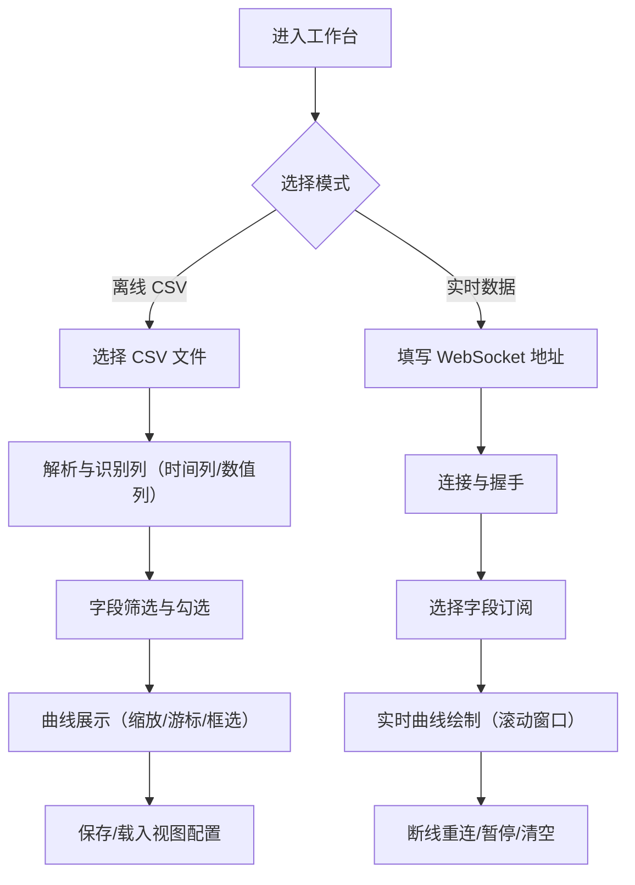

## 1. 产品概述
面向机器人调试与回放分析的日志可视化工具，支持离线 CSV 日志分析与实时数据流的曲线展示。
- 解决“看不懂/对不上/追不及”的调试痛点：快速定位异常时刻、关联多传感器与位姿变化
- 价值：提升问题复现与定位效率，形成统一的调试可视化入口

## 2. 核心功能

### 2.1 用户角色
本工具默认单角色（调试工程师），无需登录与权限区分。

### 2.2 功能模块
1. **日志工作台**：加载 CSV、选择时间列、字段筛选、曲线展示、导出视图配置
2. **实时工作台**：连接 WebSocket 数据源、字段订阅、实时曲线、断线重连
3. **视图与对齐**：多图联动（同一时间轴）、游标对齐、区间选择、缩放平移

### 2.3 页面明细
| 页面名称 | 模块名称 | 功能说明 |
|---|---|---|
| 工作台 | 顶部栏 | 离线/实时模式切换、主题/布局设置、当前数据源状态 |
| 工作台 | 数据源面板 | CSV 文件选择与解析设置（时间列、分隔符、采样率提示）；实时连接地址与状态 |
| 工作台 | 字段树 | 按列名分组/搜索，勾选后添加到曲线；支持批量添加/移除 |
| 工作台 | 曲线区 | 多子图（可新增/删除），每个子图支持多条线、图例、Y 轴自适应、单位显示（可选） |
| 工作台 | 时间控件 | 缩放/平移、区间框选、游标与十字线、同步滚动 |
| 工作台 | 视图管理 | 保存/载入视图（选择的字段、子图布局、颜色），本地存储 |

## 3. 核心流程
离线模式：用户选择 CSV → 选择/识别时间列 → 选择字段 → 交互分析（缩放、对齐、框选） → 保存视图配置
实时模式：用户填写 WebSocket 地址 → 连接 → 选择字段订阅 → 实时绘制与回放窗口（滚动） → 断线重连

## 4. 用户界面设计

### 4.1 设计风格
- 视觉方向：工业示波器 + 调试台仪表盘（深色背景、网格底纹、清晰对比的高亮色）
- 主色：近黑（背景）、石墨灰（面板）、荧光青/酸橙绿（强调）、琥珀橙（告警/高亮）
- 字体：标题使用更具机械感的无衬线展示体，正文使用等宽字体强化“调试工具”气质
- 布局：左侧数据源与字段树，右侧为可堆叠子图区域，顶部为模式与状态栏
- 交互：悬停高亮、图例点击显隐、框选缩放、跨图同步游标

### 4.2 页面设计概览
| 页面名称 | 模块名称 | UI 元素 |
|---|---|---|
| 工作台 | 顶部栏 | 模式切换 Segmented、连接状态灯、数据速率/行数、导入导出按钮 |
| 工作台 | 数据源面板 | 文件选择器、解析配置、实时地址输入框、连接按钮、错误提示条 |
| 工作台 | 字段树 | 搜索框、分组折叠、复选框、多选操作条 |
| 工作台 | 曲线区 | 多子图卡片、图例、十字线、范围选择、缩放重置 |
| 工作台 | 视图管理 | 保存/载入/删除、命名、最近使用列表 |

### 4.3 响应式
桌面优先；小屏时左侧面板可折叠为抽屉，曲线区域保持优先展示。
