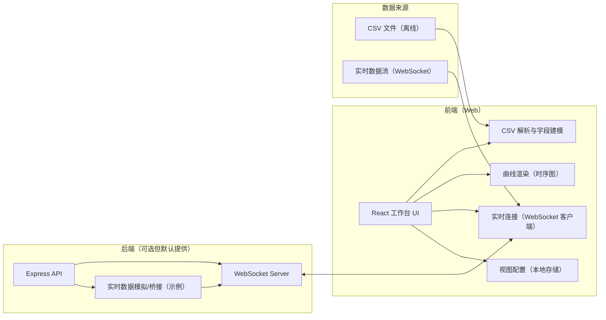
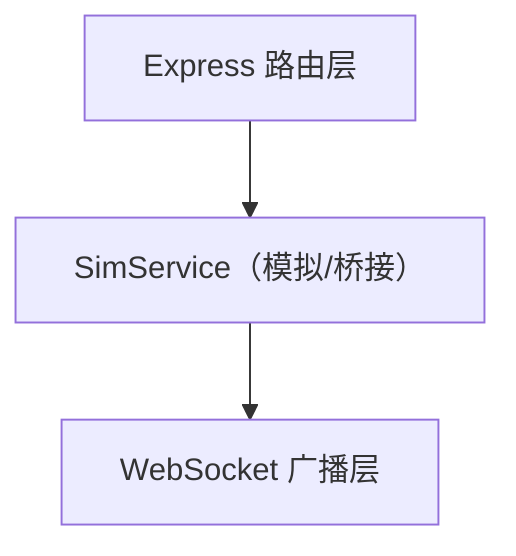

## 1. 架构设计



说明：
- 离线 CSV：优先在浏览器本地解析，避免上传与隐私/带宽问题
- 实时流：通过 WebSocket 推送 JSON 点位（timestamp + 多字段），前端增量绘制
- 后端默认提供“模拟数据源”与“可扩展桥接层”（后续可接 ROS/自定义 TCP/串口网关）

## 2. 技术选型说明
- 前端：React@18 + TypeScript + Vite
- UI：TailwindCSS（用于快速实现高质感深色工业风）
- 图表：ECharts（适合高密度时序、缩放、数据游标、数据下采样）
- CSV 解析：PapaParse（前端解析与类型推断）
- 实时通信：原生 WebSocket（前端）+ ws（后端）
- 后端：Node.js + Express（提供 WebSocket 与示例数据流）

## 3. 路由定义
| 路由 | 作用 |
|---|---|
| / | 工作台：离线与实时切换、字段选择与曲线展示 |

## 4. API 定义（后端存在时）

### 4.1 WebSocket：/ws
推送消息（服务器 → 客户端）：

```ts
export type RealtimeFrame = {
  t: number;
  data: Record<string, number>;
};
```

客户端消息（客户端 → 服务器，可选）：

```ts
export type SubscribeMessage = {
  type: "subscribe";
  keys: string[];
};
```

### 4.2 HTTP（示例）
| 方法 | 路径 | 作用 |
|---|---|---|
| GET | /api/health | 健康检查 |
| POST | /api/sim/start | 启动模拟数据推送 |
| POST | /api/sim/stop | 停止模拟数据推送 |

## 5. 服务端架构图



## 6. 数据模型（前端内部）

### 6.1 数据结构
- DataFrame（离线）：列式存储，便于按列选择与绘制
- RealtimeBuffer（实时）：环形缓冲区（rolling window），避免内存无限增长

```ts
export type ParsedCsv = {
  timeKey: string;
  keys: string[];
  rows: Array<Record<string, number>>;
};

export type ViewConfig = {
  mode: "offline" | "realtime";
  selectedKeys: string[];
  panes: Array<{ id: string; keys: string[] }>;
};
```
